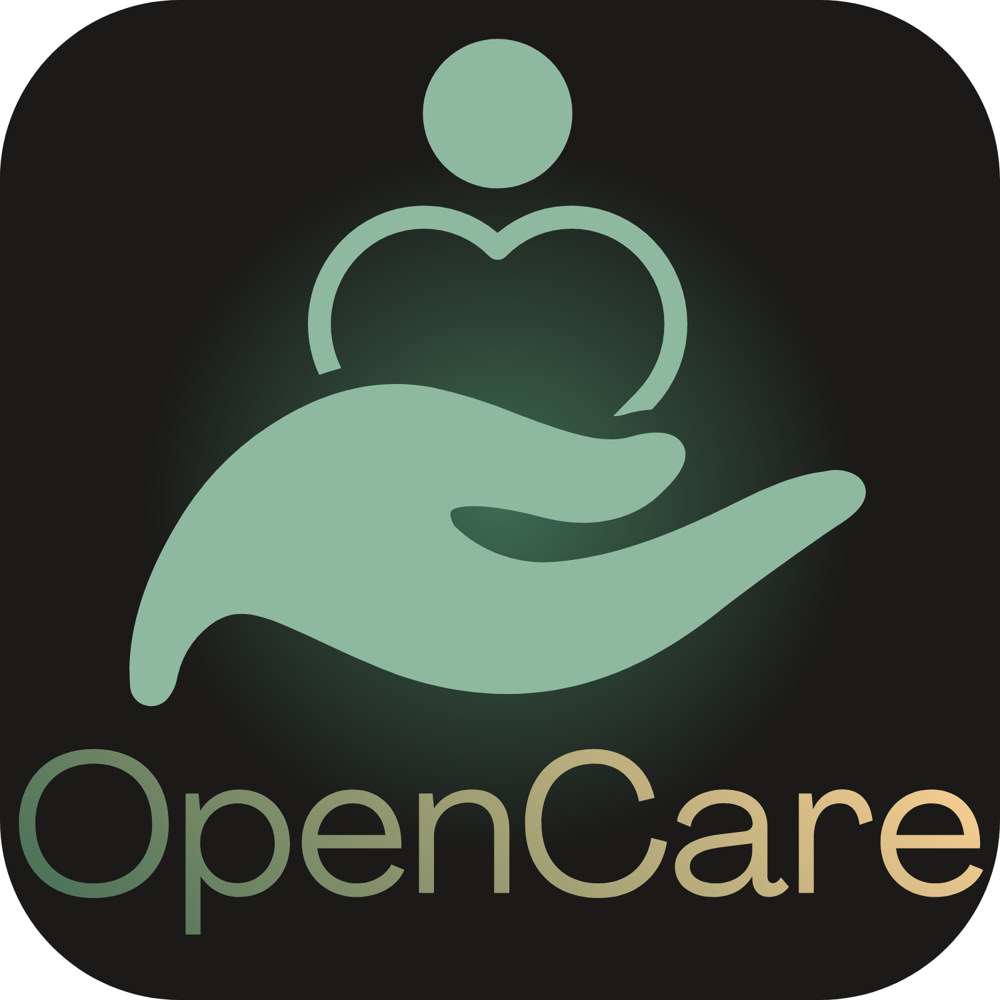

<div align="center">
  
  <h1>OpenCare</h1>
  <p><strong>The open-source, self-hosted care coordination app for family caregivers</strong><br>
  Coordinate the circle around an elderly loved one. On your server, with your data.</p>

  🇬🇧 <strong>English</strong> · 🇫🇷 <a href="README.fr.md">Français</a>

  [](https://github.com/NexaFlowFrance/OpenCare/releases/latest)
  [](https://github.com/NexaFlowFrance/OpenCare/actions/workflows/ci.yml)
  [](licence.md)
  [](https://github.com/NexaFlowFrance/OpenCare)
</div>

---

OpenCare is a **self-hosted alternative to caregiver apps like Jointly or CaringBridge**: a care
circle around each cared-for person, a real-time care journal, medications with reminders, a shared
calendar, shared expenses between siblings, and tools nobody else offers: magic links so professionals
can write without an account, a fridge QR emergency sheet, a wall tablet for the cared-for person.
All on **your** server: the health data of a vulnerable person should not live on someone else's cloud.

## ✨ Features

### The foundation

| | |
|---|---|
| 👥 **Care circle** | One circle per cared-for person, invite by link, fine-grained roles (family, professional, neighbour, read-only). Multi-circle from day one: follow both parents |
| 📔 **Care journal** | The digital liaison book: timestamped entries with photos, real time on every device (WebSocket). The heart of the app |
| 💊 **Medications** | Treatments and schedules, intake confirmation written to the journal, prescription renewal alerts |
| 📅 **Shared calendar** | Visits, medical appointments, nurse rounds, recurrences, reminders, iCal export (.ics / webcal) |
| ❤️ **Health tracking** | Hand-entered vitals (weight, blood pressure, pain, mood, temperature, glucose), curves over time |
| ✅ **Tasks and shopping** | Who does what this week, plus a shared shopping list the home aide can use too |
| 💬 **Messages** | Circle thread and direct messages, attachments |
| 📁 **Documents and contacts** | Prescriptions, reports, insurance, legal papers; the circle address book (GP, nurse, the neighbour who has the key) |

### Beyond the paid apps

| | |
|---|---|
| 💶 **Shared expenses** | A built-in Tricount: who advanced what, balances, suggested settlements, and tracking of French aids (APA, CESU, tax credit) |
| ⚖️ **Care load fairness** | "Marie covered 78% of the visits this month": objective stats to prevent burnout of the primary caregiver |
| 🔗 **Magic links** | The home aide or the nurse writes in the journal from a simple link (SMS/QR), no account, no app to install |
| 🩺 **Consultation prep** | One click: a printable summary for the doctor (key events, vitals trends, current treatments, the family's questions) |
| 🖥️ **Kiosk** | A wall tablet at your loved one's home: who is coming today (with photos), big medication reminders, weather, and two huge buttons: "All is well" / "I need help" |
| 🚨 **Emergency QR sheet** | A printed QR on the fridge: paramedics scan it and see the vital sheet (treatments, allergies, directives, contacts), always up to date |
| 📖 **"Who I am"** | A life-story page (career, pride, habits, what soothes them) shown to every new caregiver, inspired by the Alzheimer's Society "This is me" document |
| 🧳 **Respite handover** | The primary caregiver leaves for a week: an auto-generated handover pack (schedule, medications, instructions, contacts) shared by link |
| 🏠 **Passive monitoring** | Home Assistant webhooks (door sensor, coffee-maker plug, motion): "normal activity this morning" on the family dashboard, alert cascade if no sign of life. No camera, no wristband |
| 🎙️ **Voice journal** | Dictate on your way out ("20 minute visit, all fine, get paracetamol"): your self-hosted Whisper transcribes, the AI files the journal entry and the shopping item |
| 🤖 **Weekly AI digest** | Every Sunday: "Calm week. 5 visits. Stable blood pressure. Attention: 2 missed doses on Tuesday and Thursday." With slow-trend detection (recurring low mood, gradual weight loss) |

### Built to be yours

- **Self-hosted**: Docker, or a one-click **Windows installer** (Node.js and PostgreSQL bundled)
- **Offline-friendly PWA**: works in a nursing-home room with poor signal
- **Local-first AI**: Ollama on your machine, or your own Anthropic / OpenAI-compatible key, encrypted at rest
- **Full export** of all circle data, **AGPL-3.0** licensed
- **French and English** interface

## 🚀 Quick start

### 🪟 Windows installer (.exe)

For Windows users, **NexaFlow** provides an all-in-one graphical installer: Node.js and
PostgreSQL are bundled, no Docker and no configuration required.

Download `OpenCare-Setup.exe` from the [latest release](https://github.com/NexaFlowFrance/OpenCare/releases/latest),
run it, click **Start**: the app opens at http://localhost:3000. The window also shows your local
network address so the rest of the family can open it from their phones on the same Wi-Fi.

### 🐳 Docker (recommended for a server)

```bash
cp .env.example .env   # set POSTGRES_PASSWORD and JWT_SECRET
docker-compose up -d --build
```

- Frontend: http://localhost:3000
- Backend API: http://localhost:3001

### 🛠️ Development

On Windows, the simplest path needs no Docker: the script starts the bundled
PostgreSQL, writes a dev `.env`, and launches the app.

```powershell
npm install
powershell -ExecutionPolicy Bypass -File scripts\dev-windows.ps1
```

On macOS or Linux (or Windows with Docker):

```bash
npm install
docker-compose up -d postgres   # or any PostgreSQL 14+
cp .env.example .env            # set JWT_SECRET (32+ chars) and POSTGRES_PASSWORD
npm run dev
```

- Frontend: http://localhost:5173 · Backend: http://localhost:3001

The database schema bootstraps itself on first start: no manual SQL step. A
`.env` at the project root is required for `npm run dev` (the script above
creates one for you on Windows).

## 🆚 Why OpenCare?

|  | OpenCare | Jointly / CaringBridge |
|---|---|---|
| Your data on your server | ✅ | ❌ |
| Open source (AGPL-3.0) | ✅ | ❌ |
| Free, no subscription | ✅ | ⚠️ |
| Caregivers write without an account (magic link) | ✅ | ❌ |
| Shared expenses and care-load fairness | ✅ | ❌ |
| Kiosk for the cared-for person | ✅ | ❌ |
| Passive monitoring via Home Assistant | ✅ | ❌ |

## 🧰 Tech stack

**Frontend**: React 19 · TypeScript · Vite 7 · TailwindCSS · Radix UI · i18next · PWA (service worker, web push, offline)
**Backend**: Node.js 20 · Express · PostgreSQL 14+ (self-bootstrapping schema) · WebSocket · Web Push (VAPID) · JWT + bcrypt 12 · helmet · rate limiting
**DevOps**: Docker Compose · GitHub Actions · Inno Setup Windows installer

## 🔐 Security

JWT auth (7 days) · passwords hashed with **bcrypt (cost 12)** · per-circle role checks on every
request · secure HTTP headers via **helmet** · rate limiting on auth endpoints · strict configurable
CORS · server-side input validation · AI keys encrypted at rest (AES-256-GCM) · structured logs.

## 🤝 Contributing

Contributions are welcome! The product spec lives in [docs/SPEC.md](docs/SPEC.md). Open an
[issue](https://github.com/NexaFlowFrance/OpenCare/issues) or a
[pull request](https://github.com/NexaFlowFrance/OpenCare/pulls).

## 📄 License

GNU Affero General Public License v3.0 (AGPL-3.0-only), see [licence.md](licence.md).

## 🙏 Credits

Built and maintained by [NexaFlow France](https://nexaflow.fr), and offered to every family
that takes care of someone.
